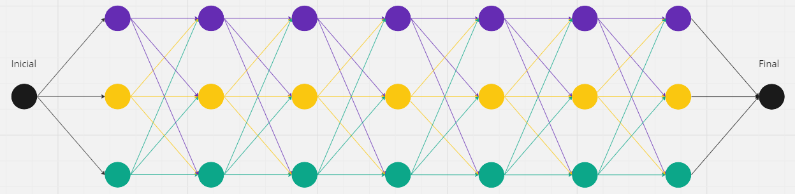

# TI2-Discretas

## Enunciado problema por desarrollar

### Título del juego 1: Campeones del Hipódromo

#### Descripción del juego

**¡Bienvenido a Campeones del Hipódromo!** En este juego, asumes el papel de un apostador en un hipódromo virtual único. 
Cinco caballos compiten en una pista de carreras única, cada una con su propio camino, lleno de desafíos. 
Cada pista es como un laberinto, y tu elección inicial marcará si eres el ganador.

#### Instrucciones del juego

1. **Elige tu caballo:** Al comienzo del juego, elige el caballo en el que crees que ganará la carrera.
La suerte estará de tu lado.

2. **Apuesta y observa:** Haz tu apuesta y observa cómo los caballos se lanzan a la carrera. 
Cada caballo navega por su pista única, luchando contra obstáculos y desafíos en su camino.

3. **Celebra la victoria:** Cuando el primer caballo cruce la línea de meta, sabrás si has acertado en tu apuesta. 
¡Si tu caballo gana, celebrarás con grandes ganancias!

#### Algoritmo del juego

El juego cuenta con cinco caballos que inician en una pista de carreras al mismo tiempo. 
Cada caballo tiene una pista realizada con 50 vértices y 141 aristas. 
Es decir, cada pista de caballo tiene su grafo. 
Este grafo es recorrido con ayuda de los algoritmos de Dijkstra y Floyd-Warshall. 
Cada arista tiene asignado un peso que es generado al inicio del juego de manera aleatoria. 
A través de hilos y con estos algoritmos, el primer caballo que llegue al último vértice es el ganador.

Imagen del grafo:

En la imagen se observa el vértice inicial, desde el cual un caballo inicia la carrera.
Desde el vértice inicial puede elegir tres vértices a los cuales ir.
Desde el siguiente vértice puede elegir otros tres vértices para ir.
Esto se repite hasta llegar al vértice final.
Cada arista que observa va a tener un peso generado aleatoriamente.
De tal manera, con los algoritmos, se busca el camino de menor peso.

--------------------------------------------------------------------------------------------------------------------------------------
## Enlace al enunciado

[Enlace al enunciado del problema](https://docs.google.com/document/d/10hhjAGeJ64UNWm14GvJy1Y3xHKX2kzeJjCLxbtblADg/edit)
